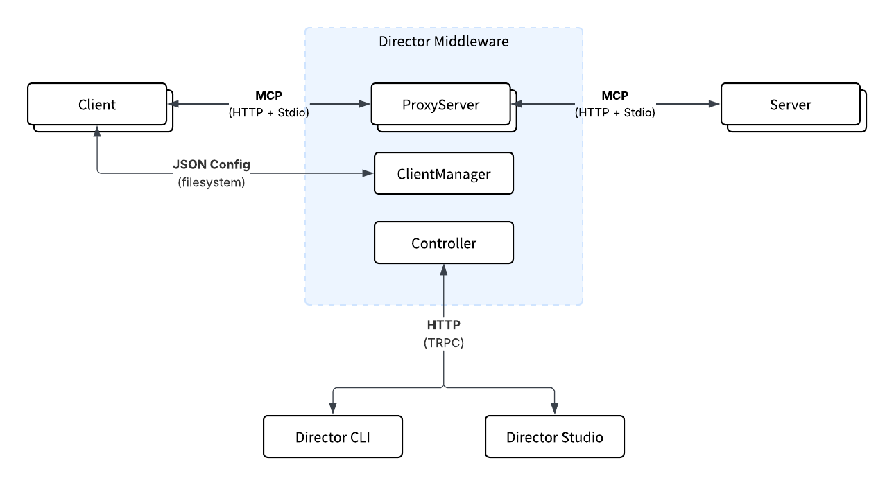

Director is an MCP middleware that sits between MCP Clients and MCP Servers. You can read more about the benefits of the product in the Welcome section.

At a high level, Director consists of a `web service` (who’s primary responsibility is proxying / routing the MCP client and server communication) and the `Director CLI & Studio` which are the primary interactive ways to interact with the `web service` (in addition to changing the config file directly). 

If you’re running locally, then all of these components will run on your machine. If you’ve deployed the `web service` to the cloud (see deployment), then you configure the CLI or GUI to connect to a remote service.

The web service contains three main components:

- `Proxy Manager`: core functionality, responsible for managing proxy server state & lifecycle.
- `Client Manager`: helps users manage MCP client config (we currently cursor and claude). It’s essentially an API that provides utility functions to read and write client JSON config on disk
- `Controller`: TRPC management APIs used to interact with Proxy Manager and Client Manager